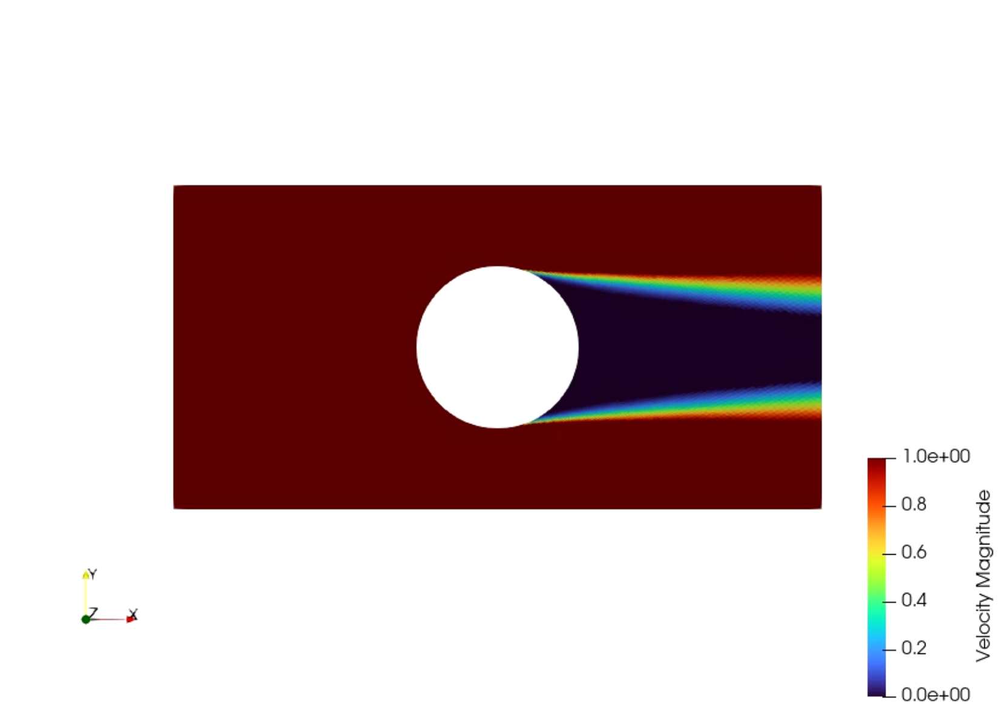
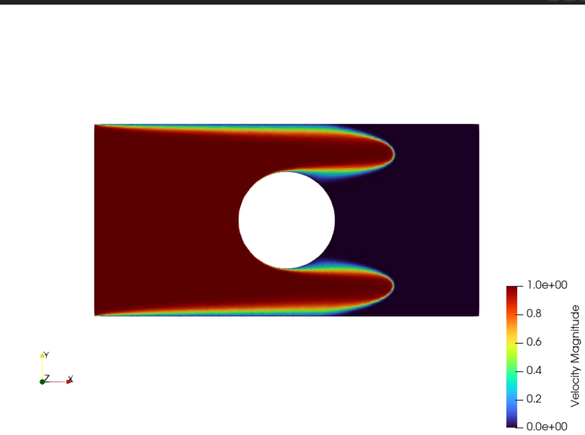

## INTRODUCTION

This is a program for 2D computational fluid dynamics (CFD) to numerically solve the Navier - Stokes equations. This version just computes the advective and viscous part and does not guarantee mass conservation.

---

## WHAT DOES THIS PROGRAM NEED?

The geometric preprocessor of this program is designed to read 2D triangular non-structured `.msh` files generated by **Gmsh**. The required text structure follows the **Gmsh ASCII 2.2** format:

```text
$Nodes
nodes_number
ID  x   y   z
...
$EndNodes
$Elements
number_of_elements
boundary_edge_ID  1   2   boundary_type   1   node_1_ID   node_2_ID  
...
triangle_ID  2   2   1   3   node_1_ID   node_2_ID   node_3_ID
...
$EndElements
```
Where boundary types are: 1 for inlets, 2 for outlets and 3 for walls. 

The details of this geometric engine can be found here: https://github.com/PavelTenorio112/Mesh-Geometric-Preprocessor

Moreover, you need to put the basic simulation parameters in the file `data.sp`.

---

## PROJECT STRUCTURE

```text
Geometric Preprocessor/
├── build/
├── docs/                                    # Documentation and theoretical notes
├── include/
│   ├── geometric_preprocess/
│   │   ├── mesh_data_print.hpp
│   │   ├── mesh_geometric_preprocess.hpp
│   │   ├── mesh_reader.hpp
│   │   └── types.hpp
│   ├── setup/
│   │   ├── fields.hpp
│   │   ├── gradient_boundary_conditions.hpp
│   │   ├── initial_conditions.hpp
│   │   ├── simulation_parameters_reader.hpp
│   │   └── velocity_boundary_conditions.hpp
│   ├── fields_data_print.hpp
│   ├── inviscid_burgers.hpp
│   ├── least_squares_gradient_construction.hpp
│   ├── simulation_parameters.hpp
│   ├── time_step_computer.hpp
│   ├── upwind_interpolation.hpp
│   └── weights_based_linear_interpolation_for_gradients.hpp
├── input/                                   # Place your Mesh.msh and the data.sp
├── output/                                  # Computed geometric results (.txt files) and .vtu
├── src/
│   ├── main.cpp
│   ├── mesh_data_printing.cpp
│   ├── mesh_geometric_processing.cpp
│   └── mesh_reader.cpp
├── .gitignore
├── CMakeLists.txt
└── README.md
```
---

## COMPILATION AND RUNNING

```bash
# Configure the build directory (Release mode)
cmake -B build -DCMAKE_BUILD_TYPE=Release

# Build the executable
cmake --build build

# Run the program
./build/Geometric_Preprocessing_Executable
```
---

## RESULTS

This program will give you a set of `.vtu` files capable of being reproduced as a video in Paraview. These are some pictures as proof of it:



